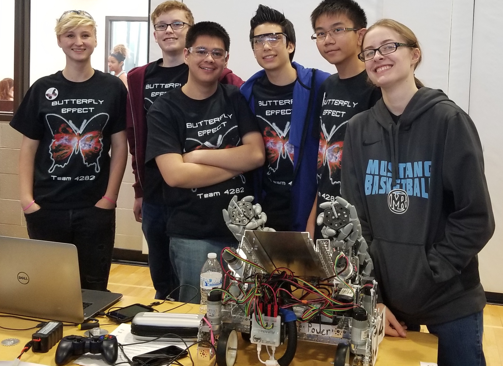

# MRHS Robotics

MRHS Robotics is a competetive robotics team that participates in the [FIRST Tech Challenge](https://www.firstinspires.org/robotics/ftc).  This 2018-2019 season will be our seventh year competing in FTC and we can't wait to get started! 

Want to know more about FTC?  Check out [this video](https://youtu.be/TLEvZgHWnrk)!

## Our Teams

### [The Butterfly Effect (4284)](teams/4284/butterflyeffect.md)

### [TBD (7795)](teams/7795/7795.md)

Want to join?  Just [email us](mailto:mrhs-robotics-team@@googlegroups.com) and a team member will reach out to you.

## Team Resources

* ["Rover Ruckus" Game (2018-2019)](resources/rr_game.md)
* [Calendar (2018-2019)](resources/calendar.md)
* [Group Communications](resources/group.md)
* [Attendance](resources/attendance.md) (access controlled)
* [Parts Requests](resources/parts.md) 
* [Photo Album](resources/photos.md)

## HOWTOs

0. [How to Update this Page](howtos/howto_contribute.md)

## Outreach
* ``[coming soon]``

