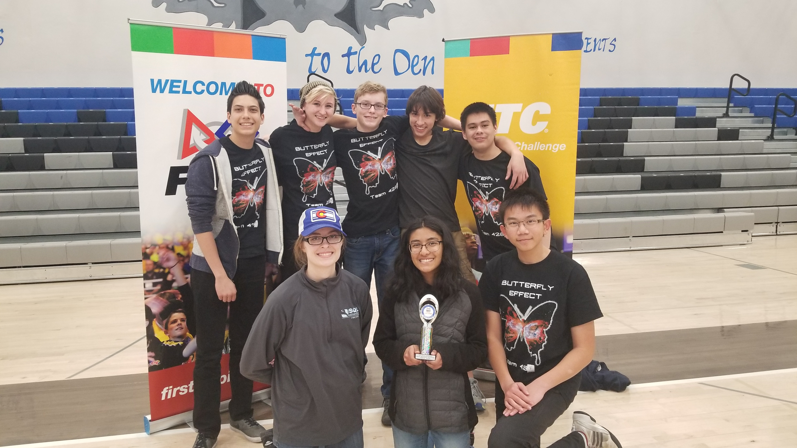

# MRHS Robotics

MRHS Robotics is a competetive robotics team that participates in the [FIRST Tech Challenge](https://www.firstinspires.org/robotics/ftc).  This 2018-2019 season will be our seventh year competing in FTC and we can't wait to get started! 

Want to know more about FTC?  Check [this](https://youtu.be/TLEvZgHWnrk) out!

{:height="200px"}

