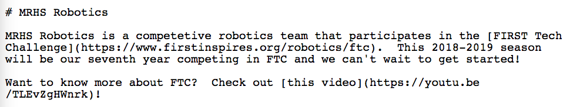
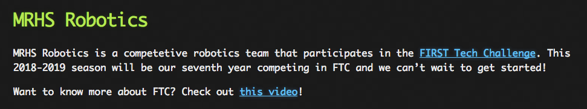

# How to Contribute

This site is hosted in GitHub Pages and redirected from our team 
domain at [http://mrhsrobotics.com](http://mrhsrobotics.com).  The source material for this site is managed in our 
[GitHub repository](https://github.com/MRHS-Robotics/mrhs-robotics).   

So how do team members update this site?  

It's actually pretty easy, and doesn't require any previous experience with web development.  It does, however, require
that you install some tools on your computer, and have a willingness to learn "markdown" which is a kind of text
formatting shorthand.  If you've ever updated a wiki page, it should look pretty familiar to you.

In this HOWTO, we will be using a terminal window to enter some text commands into a "bash" shell.  All of the commands
you need are provided here explicitly, so you don't need to know or learn bash.  But, you may find it interesting to
know why we are using the commands we are, and what other commands are available.  If so, have a look at this [bash
cheatsheet](https://courses.cs.washington.edu/courses/cse390a/14au/bash.html).

## Before You Begin

1. Create an account on [github.com](https://github.com)
2. Get a team leader to add you to the [MRHS-Robotics organization](https://github.com/MRHS-Robotics)
3. Download and install [git](https://git-scm.com/) on your computer

If installing to a PC, be sure to include the "bash" shell option.

## Clone the GitHub Repository

To update the MRHS Robotics site you will first need a copy of the source files.  You obtain this copy by "cloning" 
the GitHub repository to your own computer.  Follow these steps to clone the repository.

1. Open a terminal window and/or bash shell:

    * linux: open terminal 
    * mac: ```⌘-space```, type "terminal", then press ``enter``
    * pc: open the "bash shell" that came with your git install
  
2. Change to your Desktop folder/directory

    ```
    cd ~/Desktop
    ```

3. Use git to clone the repository to your computer

   ```
   git clone git@github.com:MRHS-Robotics/mrhs-robotics.git 
   ```
   
4. Change to the newly created ``mrhs-robotics`` folder/directory

   ```
   cd mrhs-robotics
   ```
   
5. Verify the clone worked by listing the contents of ``mrhs-robotics``

   ```
   ls -1
   ```
   You should see something like this:
   ```
   README.md
   _config.yml
   howtos
   images
   ```
   Yay, it worked!
   
## Make Changes to Local Files

Now that you have cloned the repository, you have local copies of all the text files that serve as source material for
the MRHS Robotics site.  For example, if you look in the ``mrhs-robotics`` folder on your desktop, you will see a file
named ``README.md``.  This is a text file that contains the content of the site's main page.  Open it with a text editor
and have a look.  At the same time, try also opening the [main page](http://mrhsrobotics.com) in your browser, and look
at them side-by-side.  Notice how the text is represented in the ``README.md`` and how it eventually ends up looking in
the browser.

In the ``README.md``, you should see plain text like this:



In the browser, you should see that same text content, but rendered according to the site themes:



What you are looking at in the ``README.md`` file is called "markdown".  This is a simple shorthand for entering plain
text along with subtle indications as to how that text should be rendered in the browser.  As you can see, putting a
``#`` at the beginning of a line, followed by some text, will result in that text being displayed as a section header in
your browser.  The idea here is that all you have to do to update or add new content to the site is modify the text
file, including these sorts of formatting hints, and the rendered page formatting and layout are all done for you
automatically.  Cool, right?

To learn more about markdown, and all the different formatting options it provides, have a look at [this
cheatsheet](https://guides.github.com/features/mastering-markdown/).  Also, if you don't find what you are looking for
there, Google is your friend.  Many people use markdown and, if you have a question, there's a very good chance someone
has already asked it and received an answer.  Links on [stackoverflow.com](https://stackoverflow.com/) are often
particularly useful.

There's just one thing to remember, though.  Changing the file locally won't have any impact on the site until you copy
your changes back up to the GitHub repository.  That's the next step.

## Pushing Updates to GitHub

After making changes to the local markdown files you will need to effectively do the following:

1. Add the updates to your locally staged git index
2. Commit the staged updates to the local git repository (your clone)
3. Push the updates committed in your local git repository to the GitHub repository

That all probably sounds confusing.  There are reasons for this complexity, but they really aren't important to what
we're trying to do here, so we will provide a somewhat cryptic command that you can use to do all three steps at once,
and not worry about the details today.  We assume here that you've closed the terminal window you used to clone the
repository originally, if not then go ahead and skip steps 1 and 2 below.

1. Open a terminal window and/or bash shell

2. Change to your ``mrhs-robotics`` folder/directory

    ```
    cd ~/Desktop/mrhs-robotics
    ```

3. Add, commit, and push your updates all in a single line.

   ```
   git add . ; git commit -m "update site documentation" ; git push origin master 
   ```
      
   In the command above, it is also good to change the part in quotes to more specifically describe the changes you 
   are making.  
   
4. Open the [GitHub repository](https://github.com/MRHS-Robotics/mrhs-robotics) and check to see if your updates look
   right.  Note, the layout and theme are fairly plain when viewed directly on the repository.
 
5. Open the [GitHub Pages](http://mrhsrobotics.com) page and check to see if your updates look right.  Note that it 
   can take up to a minute for updates made to the repository to be rendered on GitHub pages.
   
> **[ProTip]** At times, you will probably find yourself in a workflow loop where you edit, push, review, edit, push, 
review, etc.  At times like this, you probably want to just keep your terminal window open, so you only need to repeat
step 3 (above) to push updates.  Also, to avoid having to type in, or copy, that long command line, just use the
``up-arrow`` key to scroll back through your history to your previous use of the command, and press ``enter``.

## Pulling Updates from GitHub

Over time, and perhaps frequently when two team members are updating the site at the same time, you will find that the
steps for pushing updates to github fail with an obscure error like the following:

```
 ! [rejected]        master -> master (fetch first)
error: failed to push some refs to 'git@github.com:MRHS-Robotics/mrhs-robotics.git'
hint: Updates were rejected because the remote contains work that you do
hint: not have locally. This is usually caused by another repository pushing
hint: to the same ref. You may want to first integrate the remote changes
hint: (e.g., 'git pull ...') before pushing again.
hint: See the 'Note about fast-forwards' in 'git push --help' for details.
```
This is usually pretty easy to resolve.  When confronted with this error, try the following:

1. Open a terminal window and/or bash shell

2. Change to your ``mrhs-robotics`` folder/directory

    ```
    cd ~/Desktop/mrhs-robotics
    ```

3. Pull updates from the GitHub repository to your local clone repository

   ```
   git pull origin master
   ```

   If this results in an error indicating a "merge conflict", this means that you are making changes in the same place
in the same file to which someone else has also been making changes.  To resolve a merge conflict have a look at [this
help page](https://help.github.com/articles/resolving-a-merge-conflict-using-the-command-line/) or talk to a team leader
for help, before attempting to push your own local changes to the GitHub repository.

