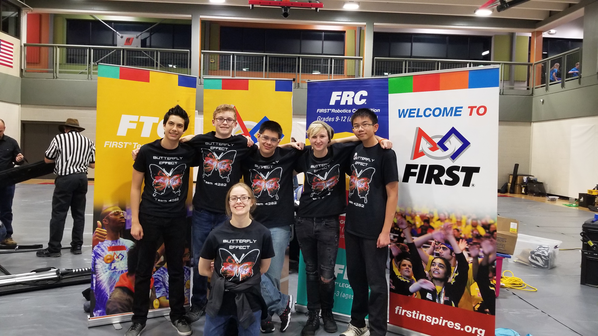

# The Butterfly Effect 

## Our Motto

The [Butterfly Effect](https://www.youtube.com/watch?v=Hp8wGQW-Y48) coined by [Edward Lornez](https://www.britannica.com/biography/Edward-Lorenz), is the theory that a single occurence, such as the flap of a butterfly's wing, can change the course of the universe. We believe that our futures, weather they be in enineering or elsewhere, are impacted immensely by what we do today, right down to the smallest choices to be kind to others. That's why we are in this club, because the small impact we make on students we visit and on one another will one day be huge. 

## Our Team

This is our 3rd year competeing as The Butterfly Effect, and we are excited to see what new ideas we see in the upcoming 2018-2019 season! Our team is composed of many diverse perspectives, and through collaboration, we enhanced our ability to achieve our goals efficiently by listening and considering eachother's ideas equally. We are dedicated to our team and our community, and we can't wait for kickoff!

## Daily Logs 

### 9/8/18 - Kickoff

Kickoff, Ashley, Jess, Ev, and Buck attended a presentation on the glyph intake design of team Black Diamond and a basic coding course. Notes taken during the presentation included: 
*Wheel intake systems are quick and efficient
*Expanding the bot can be the result of a different mechanism pushing the expanding piece out
	*Locking mechanism
*goBilda goRail (screw linear slide thingy) is really compact and efficient

During the challenge our team had to come up with a way to alert crew members of heat resistant tiles becoming damaged on a spaceship. Our team came up with creating a system of wires that would run through a tile, and when the tile was attached to the ship it would complete a circuit that, if the tile falls off or is damaged, would break and set off a signal to the crew alerting them of the damage. In retrospect, we did not consider the expenses of wires that can withstand the heat present in the tiles, because logically the tiles are only thick enough to protect the ship underneath, so anything within the tile would not be as fully protected as it would be behind the tile. Therefore the wires would have to be heavily heat resistant themselves to prevent them from melting. We are unsure ourselves if that would be even possible let alone cost effective to implement in every single tile lining the ship. We also offered the idea of using geiger counters to measure the exposure of radiation on the ship under the (incorrect) assumption that the tiles filter out radiation even if it was a small, but detectable, amount. Considering how expensive geiger counters are, this plan would not be feasible. 

Initial reactions to the game reveal was that it seemed relatively straight forward, so many teams are going to have similar game strategies. Our game strategy is going to focus on Landing during autonomous and Latching in the end game, since they offer the most points. However, since these offer the most points many other teams are also going to prioritize these tactics, so we can’t rely on them to take us through to finals. Sampling we can achieve with minimal hardware, just a color sensor (and possibly a servo to knock the sample off depending on how close together the samples are placed and how wide our robot it, because otherwise we could ram the samples off), so that would be our second priority. Claiming and parking during autonomous seem to be points -- as long as we have capable wheels to overcome the crater walls -- so we will focus on those once we have a good landing/latching mechanism implemented and a reliable sampling program. Collecting gold and silver is going to be the deciding factor between good robots and winning robots, but we want to achieve good before we can get any further, so collection and placement, which may end up being the most difficult aspect, will be our final venture.

Next meeting we will play the video for members who haven’t seen it yet and revisit our strategic and build plans as well as outreach thoughts.
A
A
A
A
A
A
A
A
A
A
A
A
A
A
A
A
A
A
A
A
A
A
A
A
A
A
A
A
A
A
A
A
A
A
A
A
A
A
A
A
B
B
B
B
B
B
B
B
B
B
B
B
B
B
B
B

